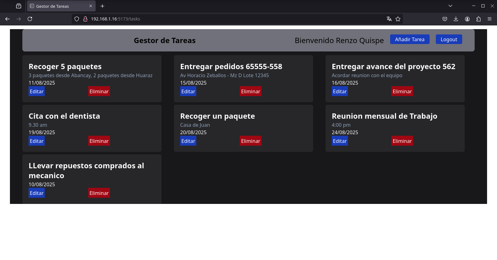
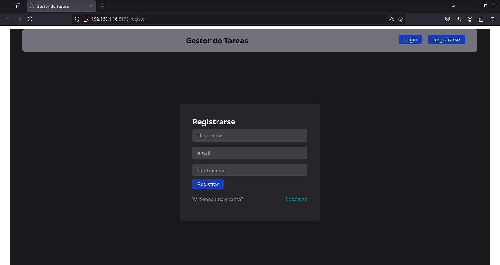
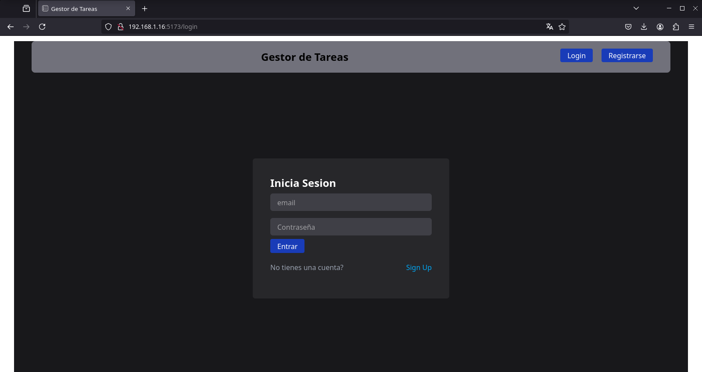

# Gestor de Tareas Simple

Aplicación web para gestionar tareas, desarrollada con React, Node.js con Express y MongoDB.

- - -

### Requisitos Previos

- Docker y Docker Compose instalados.
- Acceso a tu dirección IP local para configuración de red

- - -

### Inicio rápido con Docker

#### Configurar el archivo `.env` de ejemplo
```
MONGO_DB_NAME=gestortareas
MONGO_USER=admingestortareas
MONGO_PASS=admin123456789
MONGO_HOST=mongo
MONGO_PORT=27017
MONGO_URI=mongodb://${MONGO_USER}:${MONGO_PASS}@${MONGO_HOST}:${MONGO_PORT}/${MONGO_DB_NAME}?authSource=admin

NODE_PORT=3000

JWT_SECRET=jwtsecreto123456789

HOST_IP=192.168.1.16       # ¡MODIFICAR!
VITE_API_URL=http://${HOST_IP}:${NODE_PORT}
```

#### Levantar los contenedor y acceder a la aplicación web
```
docker compose up --build
```
Accede a la aplicación web desde cualquier dispositivo en tu red local usando: `http://HOST_IP:5173` (En el ejemplo: `http://192.168.1.16:5173`)

<p align="center"> 
    
</p>
<p align="center"> 
    
</p>
<p align="center"> 
    
</p>